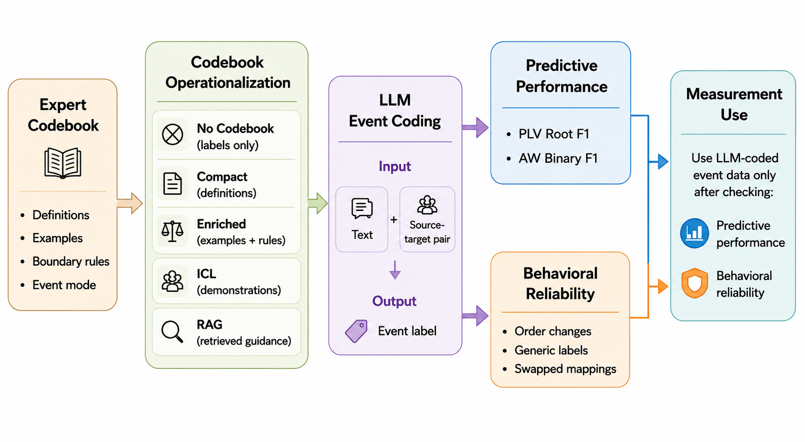

# When Better Codebooks Are Not Enough

Official simplified code for the paper **When Better Codebooks Are Not Enough: Predictive Performance and Behavioral Reliability in LLM Political Event Coding**.

📄 Paper: `EMNLP_2026___Codebook_Event_Coding.pdf`

## Key Finding

Better codebooks improve predictive performance, but higher accuracy does not guarantee behavioral reliability.

<p align="center">
  
</p>

Across PLV-style root-label event coding and AW-style Cooperation/Conflict coding:

- Richer codebook prompts improve event-code prediction, especially for fine-grained labels.
- Models can produce valid labels and recover definitions while still failing reliability checks.
- Controlled changes to codebook order, generic label names, and label-definition mappings reveal behavior not captured by accuracy alone.

> **Codebook-guided LLM event coders should be evaluated by both predictive accuracy and behavioral reliability.**

## Artifact Overview

This folder keeps the code used for the paper's two main evaluations: predictive performance under different codebook prompts and behavioral reliability under controlled codebook changes.

## Repository Layout

```text
part1_predictive_evaluation/   Predictive performance scripts and prompt variants.
part2_behavioral_probes/       Behavioral reliability tests, codebooks, data splits, and notebooks.
framework_v2.png               Paper framework figure used above.
README.md                      This overview.
```

## What Is Included

- PLV-style source-target event coding with PLOVER root labels.
- AW-style binary Cooperation/Conflict coding.
- Predictive prompt variants: `No Codebook`, `Compact`, `Enriched`, `ICL`, `CoT`, and `RAG`.
- Behavioral reliability checks for:
  - original-condition accuracy
  - legal-label compliance
  - definition recovery
  - codebook order changes
  - generic labels
  - swapped label-definition mappings

## Dependencies

For Part II behavioral checks:

```bash
cd part2_behavioral_probes
pip install -r requirements.txt
```

Part I prediction scripts use Ollama by default. Model weights, generated outputs, figures, score files, notebooks, and original source files are not included.

## Basic Commands

Check Part II commands:

```bash
cd part2_behavioral_probes
python run.py --help
```

Create Part II splits from included raw CSVs:

```bash
python run.py --make-dataset-splits --split-builder-datasets plover,aw
```

Run Part I help commands:

```bash
cd ../part1_predictive_evaluation
python3 primary/plover_predictive_experiments.py --help
python3 primary/aw_predictive_experiments.py --help
```
